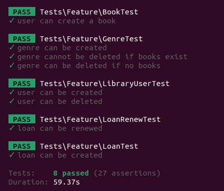

## 📚 Sistema de Gerenciamento de Biblioteca

Este projeto é um sistema para gerenciar **usuários**, **livros**, **gêneros literários** e **empréstimos** em uma biblioteca.
Foi desenvolvido utilizando Laravel seguindo boas práticas de arquitetura e organização de código.

---

## ✅ Tecnologias utilizadas

* **Laravel 11**
* **PHP 8.3**
* **MySQL**

---

## 🚀 Como executar o projeto

1. Clone o repositório:

   ```bash
   git clone https://github.com/seu-usuario/seu-projeto.git
   cd seu-projeto
   ```

2. Instale as dependências:

   ```bash
   composer install
   ```

3. Copie o `.env` e configure:

   ```bash
   cp .env.example .env
   ```

4. Gere a chave de aplicação:

   ```bash
   php artisan key:generate
   ```

5. Configure o banco de dados no `.env`

6. Rode as migrations **com seeders** (dados fictícios incluídos):

   ```bash
   php artisan migrate:fresh --seed
   ```

   Isso criará:

   * 5 gêneros
   * 3 usuários
   * 3 livros (alguns emprestados)
   * 2 empréstimos (sendo 1 pendente e 1 atrasado)

7. Inicie o servidor:

   ```bash
   php artisan serve
   ```

---

## 📌 Rotas disponíveis

### 📊 Dashboard (`/`)

* `GET /` — Exibe o painel com estatísticas gerais (livros, empréstimos, atrasos, etc.)

---

### 👤 Usuários (`/usuarios`)

* `GET /usuarios` — Listar usuários
* `GET /usuarios/create` — Formulário para novo usuário
* `POST /usuarios` — Cadastrar novo usuário
* `GET /usuarios/{id}/edit` — Editar usuário
* `PUT /usuarios/{id}` — Atualizar usuário
* `DELETE /usuarios/{id}` — Excluir usuário

### 📚 Livros (`/livros`)

* `GET /livros` — Listar livros
* `GET /livros/create` — Formulário para novo livro
* `POST /livros` — Cadastrar novo livro
* `GET /livros/{id}/edit` — Editar livro
* `PUT /livros/{id}` — Atualizar livro
* `DELETE /livros/{id}` — Excluir livro

### 🏷️ Gêneros (`/generos`)

* `GET /generos` — Listar gêneros
* `GET /generos/create` — Formulário para novo gênero
* `GET /generos/{id}/edit` — Editar gênero
* `POST /generos` — Cadastrar novo gênero
* `DELETE /generos/{id}` — Excluir gênero
  ⚠️ *Gêneros com livros associados não podem ser excluídos.*

### 🔄 Empréstimos (`/emprestimos`)

* `GET /emprestimos` — Listar empréstimos
* `GET /emprestimos/create` — Formulário para novo empréstimo
* `POST /emprestimos` — Cadastrar novo empréstimo
* `PATCH /emprestimos/{id}/devolver` — Marcar empréstimo como devolvido
* `PATCH /emprestimos/{id}/atrasado` — Marcar como atrasado
  ⚠️ *Somente possível após a data de devolução.*
* `PATCH /emprestimos/{id}/renovar` — Renovar empréstimo
  ⚠️ *Permitido apenas se o empréstimo estiver pendente e o usuário não tiver empréstimos em atraso.*

---

## ⚙️ Regras de negócio

* Empréstimos não podem ser renovados se:

  * Já estiverem vencidos
  * O usuário tiver empréstimos com status "Atrasado"
* Um gênero com livros associados **não pode ser excluído**
* Livros são marcados como "Emprestado" ou "Disponível" automaticamente
* Empréstimos vencidos **não podem ser marcados como "Atrasado" antes do vencimento**
* Usuários com empréstimos registrados não podem ser excluídos
* É possível cadastrar um empréstimo retroativo informando a **data de retirada** (`start_date`)

---

## 🧠 Abordagens adotadas

### 🧩 Observer Pattern

Utilizado para **registrar logs automaticamente** quando um registro de `Book`, `LibraryUser`, `Genre` ou `Loan` for criado, atualizado ou deletado.

Exemplo:

```php
Log::info('Book created', ['id' => $book->id]);
```

### 💼 Service Layer

As **lógicas de negócio mais complexas** (como renovação de empréstimos) foram movidas para classes de serviço, como `LoanService`, garantindo:

* Código mais limpo nos controllers
* Responsabilidade única
* Melhor testabilidade

---

## 🧪 Testes (Opcional)

Este projeto possui uma base inicial de testes com **PHPUnit**. Você pode executar testes automatizados para garantir que os principais fluxos (como criação de livros) funcionam corretamente.

### ✅ Requisitos

1. **PHP com extensões obrigatórias** (incluindo `mbstring`)

   * Verifique se foi instalada:

     ```bash
     php -m | grep mbstring
     ```

2. **Banco de dados separado para testes**

   * Crie um banco de dados exclusivo para os testes, ex: `biblioteca_test`.

---

### ⚙️ Configurar o ambiente de testes

1. Copie o arquivo `.env` para `.env.testing`:

   ```bash
   cp .env .env.testing
   ```

2. Edite o `.env.testing` e configure com um banco de dados de testes:

   ```dotenv
   APP_ENV=testing
   APP_KEY=base64:...

   DB_CONNECTION=mysql
   DB_HOST=127.0.0.1
   DB_PORT=3306
   DB_DATABASE=biblioteca_test
   DB_USERNAME=usuario
   DB_PASSWORD=senha
   ```

---

### 🚀 Executar os testes

```bash
php artisan test --env=testing
```

